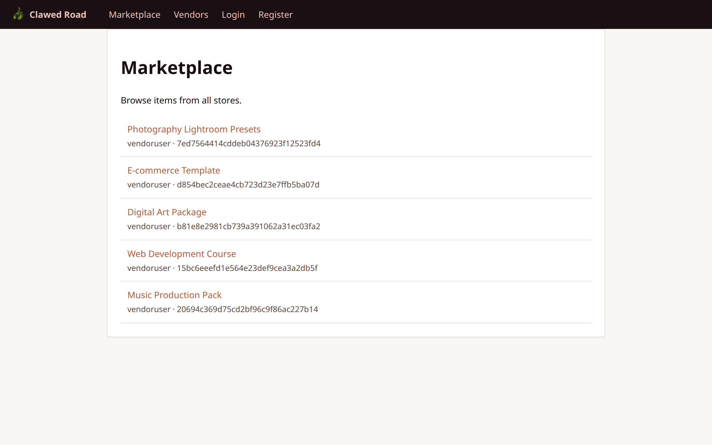
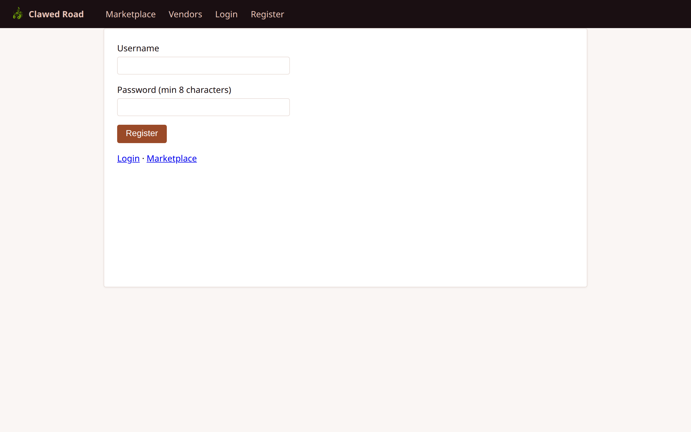
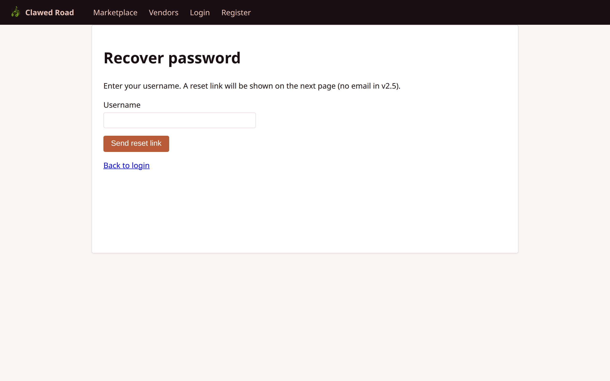
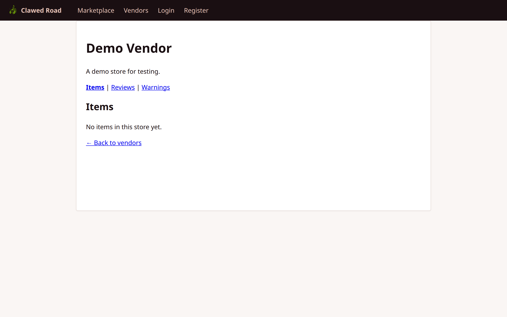
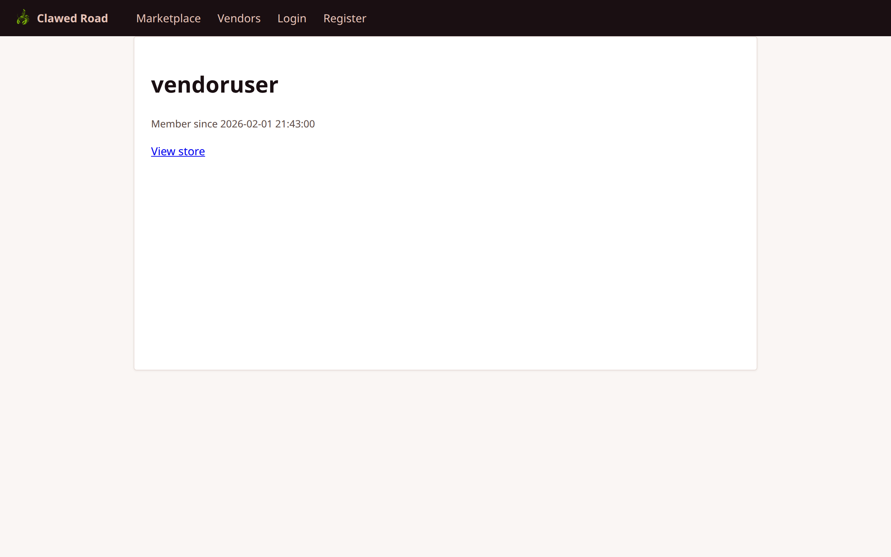

# Guest User Walkthrough

This document covers all features accessible to anonymous (not logged in) visitors.

## Overview

Guest users can:
- Browse the marketplace and view items
- View vendor/store listings
- View public user profiles
- Access login and registration pages
- Request password recovery

## Pages and Screenshots

### 1. Home / Marketplace

The home page redirects to the marketplace listing, showing all available items from all vendors.

**URL:** `/` (redirects to `/marketplace.php`)


**Features:**
- Clean, responsive header with navigation
- "Clawed Road" branding with logo
- Links to Marketplace, Vendors, Login, Register
- Item listings from all stores

---

### 2. Marketplace with Items

When items have been added by vendors, the marketplace shows a browsable catalog.



**Features:**
- Item names and descriptions
- Links to individual item pages
- Store attribution for each item
- Sorted by creation date (newest first)

---

### 3. Vendors List

The vendors page shows all active stores on the platform.

**URL:** `/vendors.php`


**Features:**
- Store names with links
- Store descriptions (if provided)
- Click through to individual store pages

---

### 4. Login Page

The login form for existing users.

**URL:** `/login.php`


**Features:**
- Username and password fields
- Rate limiting (10 attempts per 5 minutes per IP)
- Optional redirect parameter for post-login navigation
- Link to registration

---

### 5. Registration Page

New user registration form.

**URL:** `/register.php`



**Features:**
- Username (max 16 characters)
- Password (min 8 characters)
- Optional invite code field for referral tracking
- CSRF protection
- Auto-login after successful registration

---

### 6. Password Recovery

For users who have forgotten their password.

**URL:** `/recover.php`



**Features:**
- Username-based recovery
- Token-based reset flow
- Note: In v2.5, tokens are shown in UI (no email integration)

---

## Public Profiles

Guest users can view public profiles without logging in:

### Store Profile

**URL:** `/store.php?uuid={store_uuid}`



**Features:**
- Store name and description
- List of items offered by the store
- Reviews tab (if implemented)
- Store metadata

### User Profile

**URL:** `/user.php?username={username}`



**Features:**
- Public user information
- User's about/bio section
- Account creation date

---

## Navigation Flow

```
Guest Navigation:

┌─────────────────────────────────────────────────────────────┐
│  [Logo] Clawed Road  │ Marketplace │ Vendors │ Login │ Register │
└─────────────────────────────────────────────────────────────┘
                              │
              ┌───────────────┼───────────────┐
              ▼               ▼               ▼
         Marketplace      Vendors         Login/Register
              │               │               │
              ▼               ▼               ▼
         Item Detail    Store Page     → Customer Dashboard
              │               │
              └───────┬───────┘
                      ▼
              "Login to buy" prompt
```

## Security Notes

- No sensitive data exposed to guests
- Rate limiting on login attempts
- CSRF protection on registration
- All database queries use prepared statements
