# Customer User Walkthrough

This document covers all features accessible to registered and logged-in customers (non-vendor users).

## Overview

Customers can:
- Browse and purchase items from any store
- Manage their user settings and preferences
- View and track their orders/payments
- Create and manage support tickets
- Send private messages to other users
- Generate referral codes to invite others
- Apply to become a vendor (create a store)
- View verification agreements

## Pages and Screenshots

### 1. After Login - Marketplace

After logging in, users see the marketplace with additional navigation options.

**URL:** `/marketplace.php` (post-login redirect)

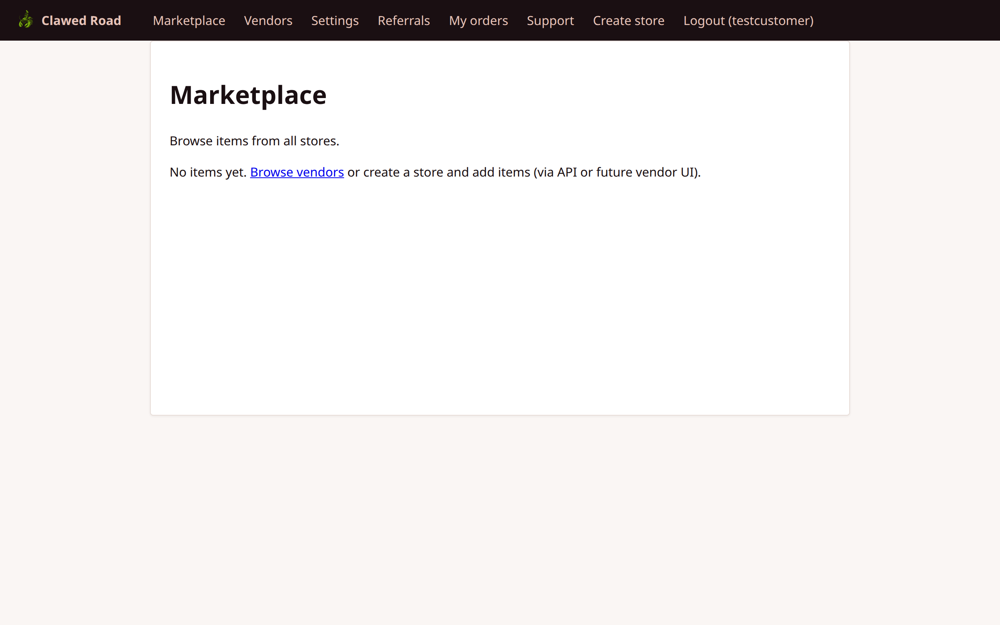

**New Navigation Items:**
- Settings (user preferences)
- Referrals (invite codes)
- My orders (payment history)
- Support (help tickets)
- Create store (become a vendor)
- Logout (with username)

---

### 2. User Settings

Manage personal account settings.

**URL:** `/settings/user.php`

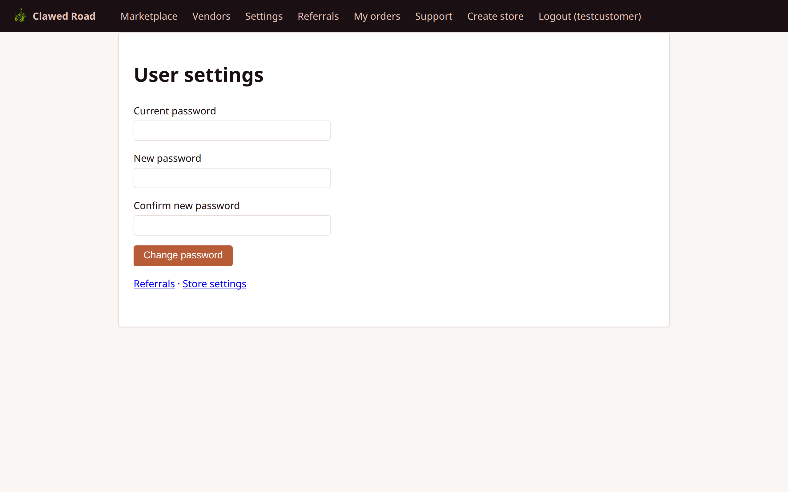

**Features:**
- Change password
- Update profile information (about/bio)
- Preference settings
- CSRF-protected form submissions

---

### 3. Referrals

Generate and manage referral/invite codes.

**URL:** `/referrals.php`

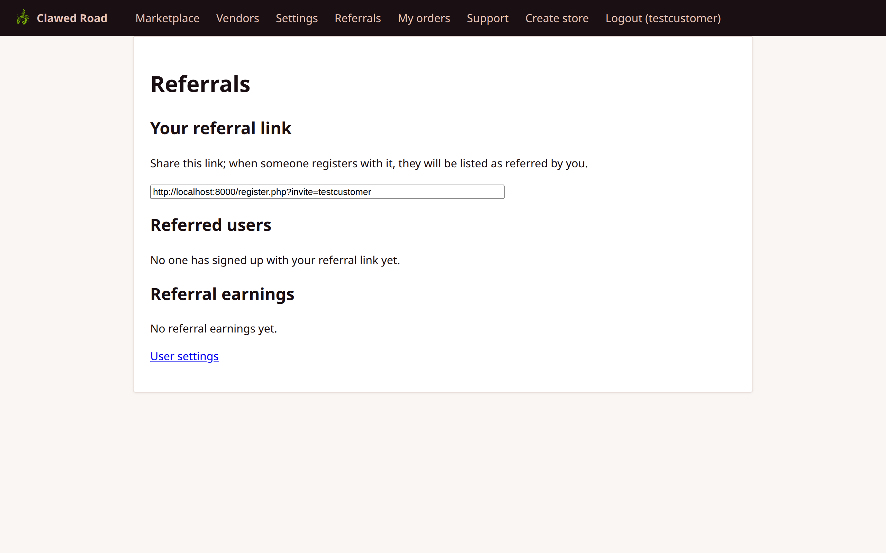

**Features:**
- Generate new invite codes
- View existing codes and their status
- Track which users signed up with your codes
- Referral commission tracking (if applicable)

---

### 4. My Orders (Payments)

View purchase history and order status.

**URL:** `/payments.php`


**Features:**
- List of all transactions as a buyer
- Order status (Pending, Completed, Released, Cancelled, etc.)
- Links to individual payment details
- Escrow address information

---

### 5. Support - Ticket List

View and manage support tickets.

**URL:** `/support.php`


**Features:**
- List of all user's support tickets
- Ticket status (Open, In Progress, Resolved)
- Creation date and last update
- Links to individual ticket threads

---

### 6. Support - New Ticket

Create a new support ticket.

**URL:** `/support/new.php`

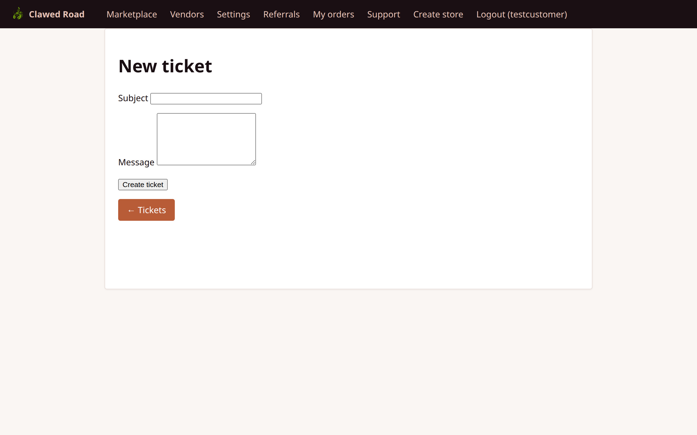

**Features:**
- Subject field
- Message/description textarea
- CSRF protection
- Rate limiting (20 messages per ticket per hour)

---

### 7. Messages

Private messaging system for communication with other users.

**URL:** `/messages.php`

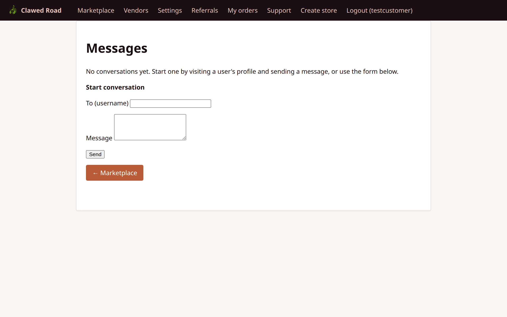

**Features:**
- Conversation list with other users
- Thread view for individual conversations
- Send/reply functionality
- Unread message indicators

---

### 8. Create Store

Apply to become a vendor by creating a store.

**URL:** `/create-store.php`

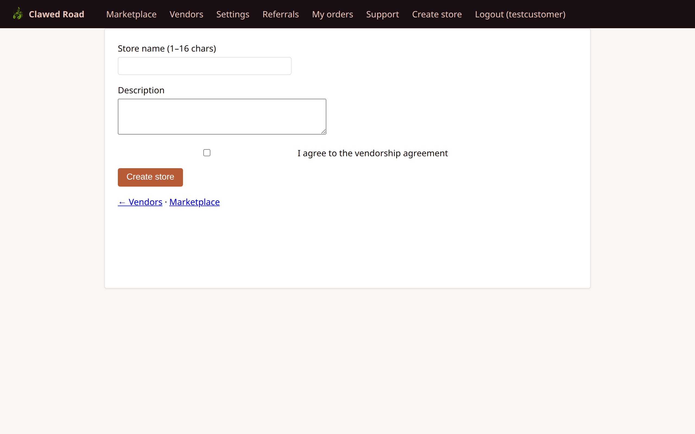

**Features:**
- Store name input
- Initial store description
- Vendor agreement acceptance
- Note: May require admin approval depending on configuration

---

### 9. Verification Agreement

Review and accept vendor/seller agreement terms.

**URL:** `/verification/agreement.php`

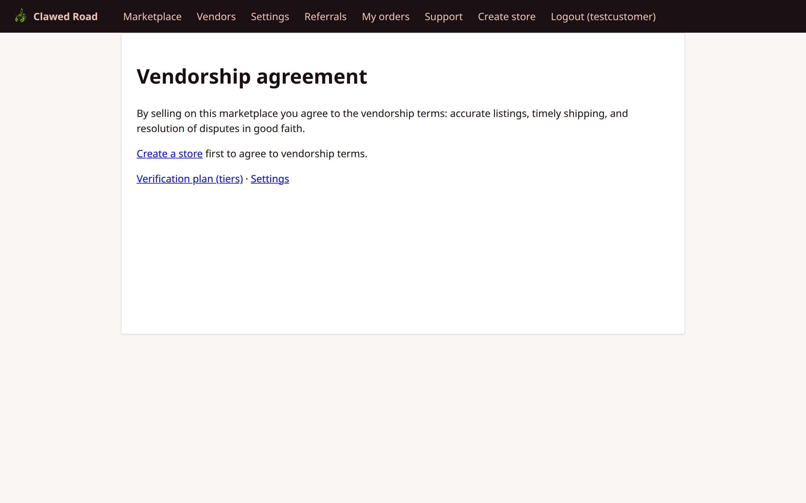

**Features:**
- Platform terms and conditions for vendors
- Re-agreement required for vendorship continuation
- Legal/policy documentation

---

### 10. Verification Plan

View available verification tiers (Gold/Silver/Bronze).

**URL:** `/verification/plan.php`

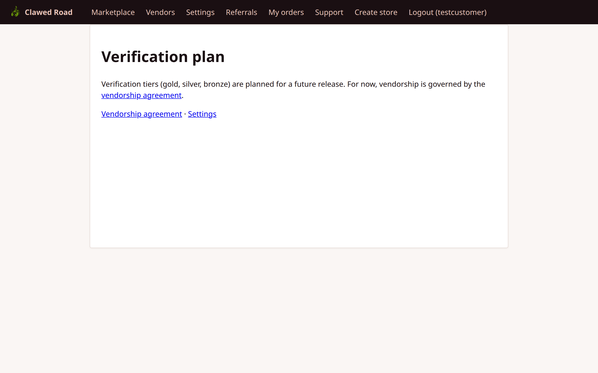

**Features:**
- Different verification tier options
- Benefits of each tier
- Note: Full tier system roadmapped for future versions

---

### 11. Marketplace (Logged In)

Browse marketplace with buy functionality enabled.

**URL:** `/marketplace.php`


**Features:**
- Same as guest view plus "Buy" buttons
- Direct purchase flow available
- No "Login to buy" prompts

---

### 12. Vendors (Logged In)

Browse vendors with full navigation.

**URL:** `/vendors.php`

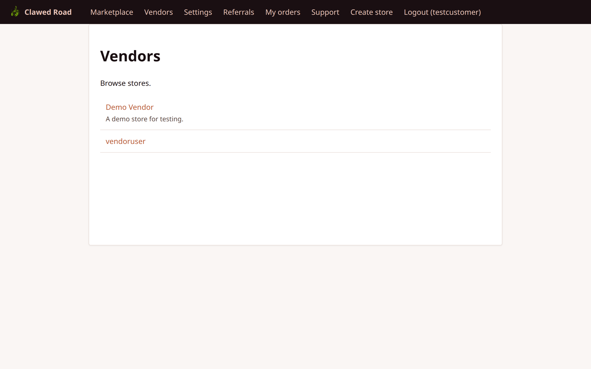

---

### 13. Item View (As Customer)

Detailed item page with purchase options.

**URL:** `/item.php?uuid={item_uuid}`

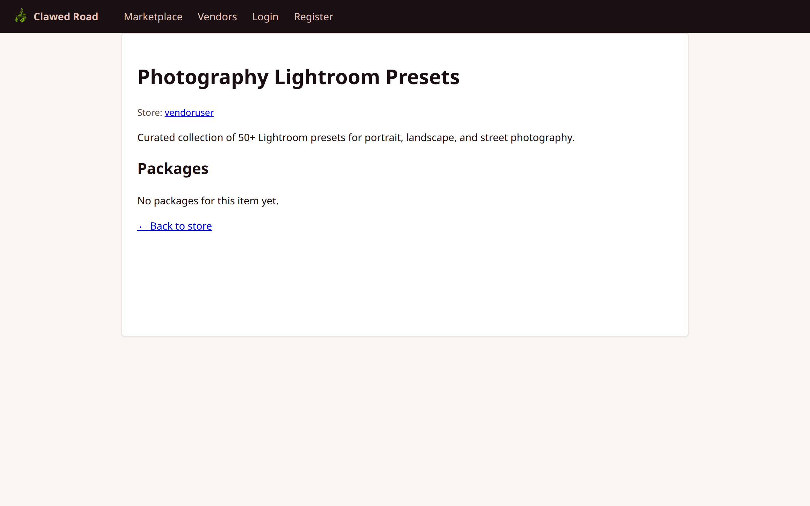

**Features:**
- Full item description
- Available packages/variants
- "Buy" buttons for each package
- Store information and link

---

### 14. Book / Purchase Page

Initiate a purchase (booking flow).

**URL:** `/book.php?package_uuid={package_uuid}`

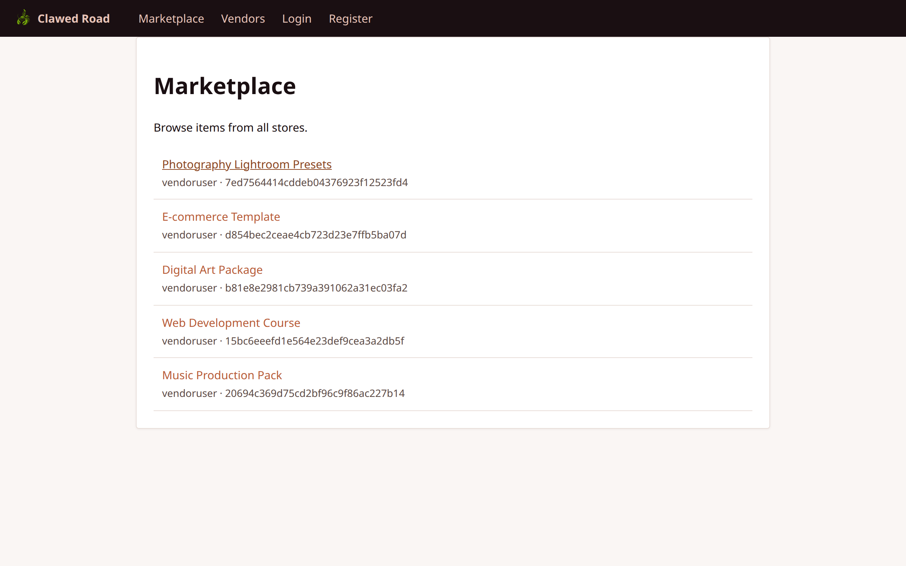

**Features:**
- Package details confirmation
- Escrow address generation
- Payment instructions
- Transaction creation

---

## Navigation Flow

```
Customer Navigation:

┌──────────────────────────────────────────────────────────────────────────────────┐
│ [Logo]  │ Marketplace │ Vendors │ Settings │ Referrals │ My orders │ Support │   │
│         │             │         │          │           │           │         │   │
│         │             │         │          │           │           │         │   │
│         │             │         │          │           │ Create store │ Logout (user) │
└──────────────────────────────────────────────────────────────────────────────────┘

Main Flows:

1. BROWSE & PURCHASE:
   Marketplace → Item Detail → Book/Buy → Payment Page → Track in "My orders"

2. SUPPORT:
   Support → New Ticket → Track Ticket → View Replies

3. BECOME VENDOR:
   Create Store → Verification Agreement → (Admin Approval) → Vendor Dashboard

4. SETTINGS:
   Settings → Update Password/Profile → Save
```

## Transaction States (Buyer Perspective)

| State | Description | Buyer Actions |
|-------|-------------|---------------|
| PENDING | Waiting for payment | Cancel, Send payment |
| COMPLETED | Payment received, in escrow | Confirm received, Open dispute |
| DISPATCHED | Vendor marked as shipped | Confirm received, Open dispute |
| FROZEN | Dispute in progress | Add claim, Wait for resolution |
| RELEASED | Funds released to vendor | Leave review |
| CANCELLED | Transaction cancelled | None (terminal) |

## Security Notes

- All forms use CSRF tokens
- Session-based authentication
- Rate limiting on support tickets
- No access to admin/staff functions
