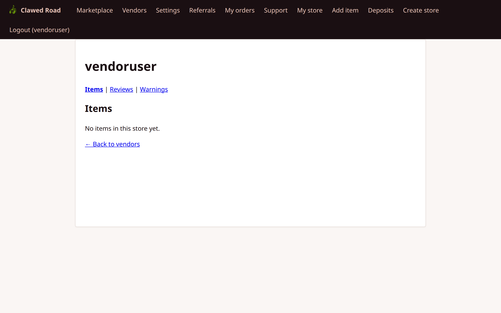
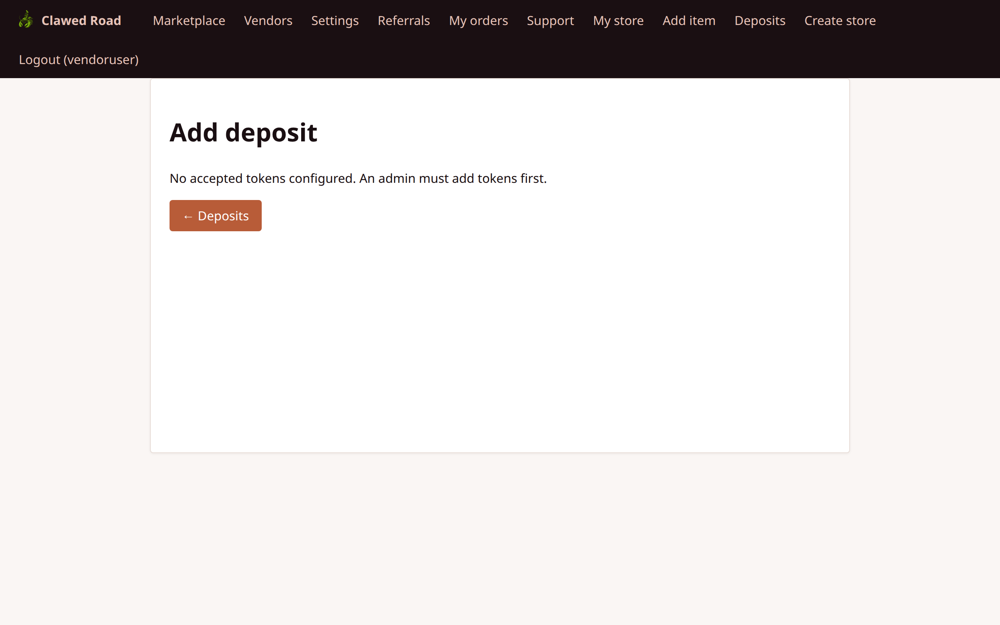
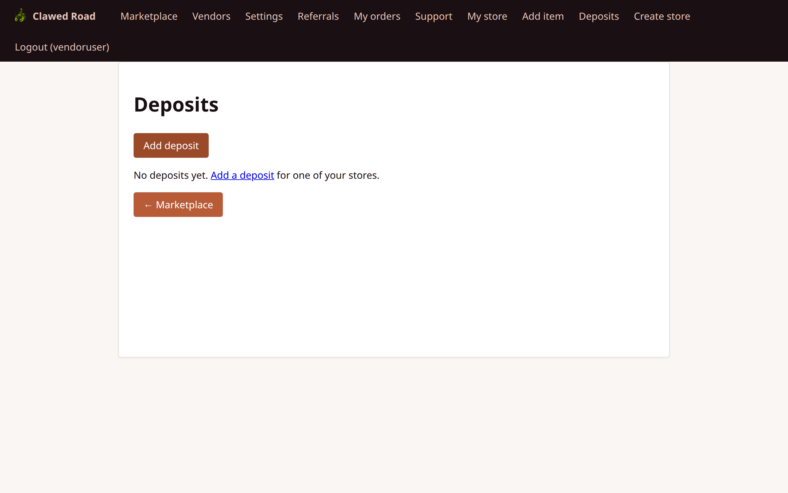
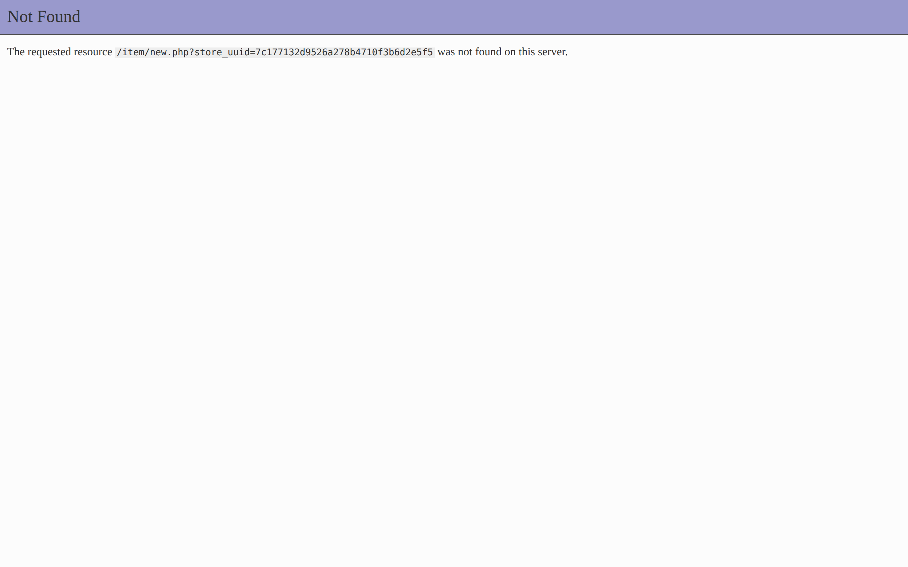
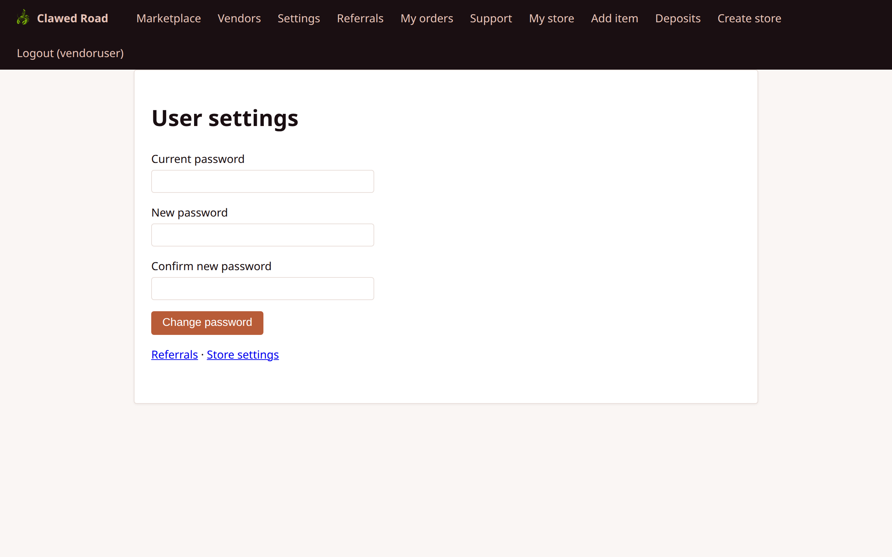
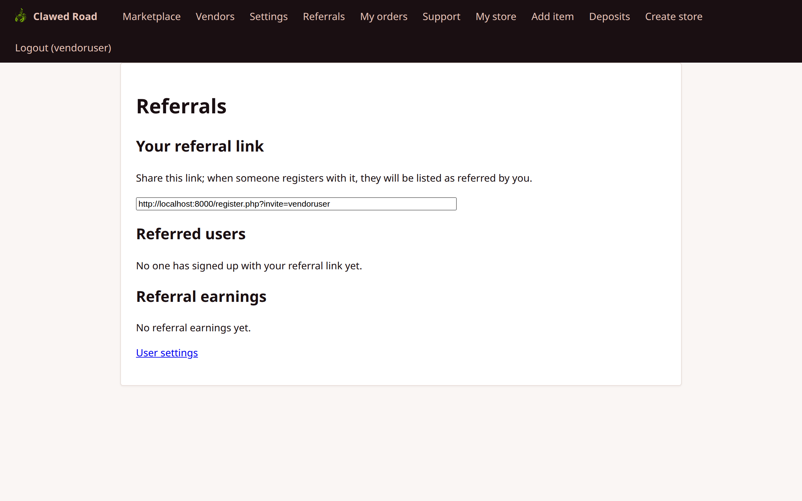
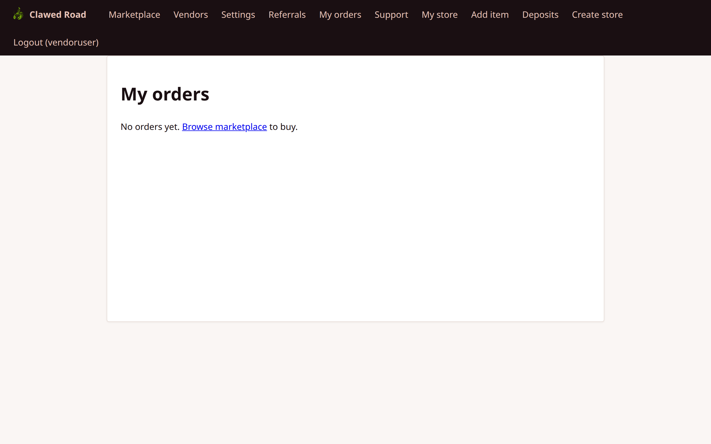
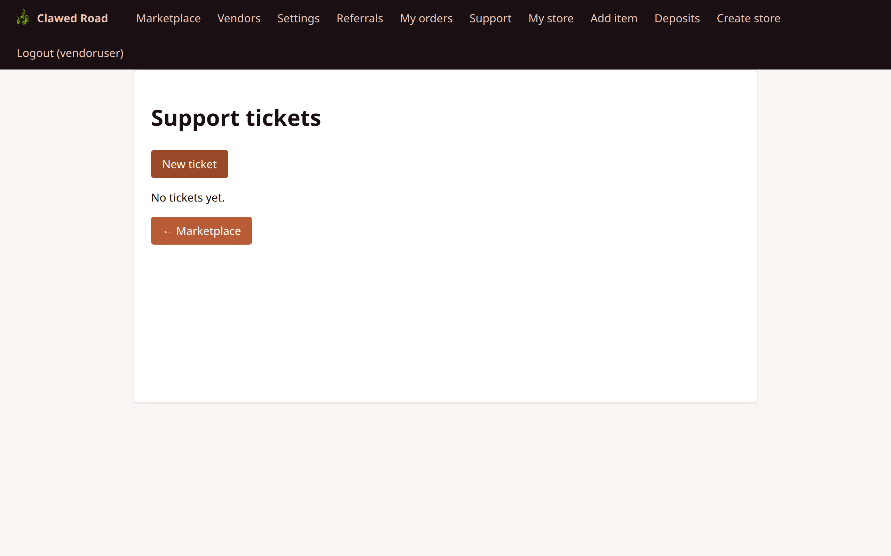

# Vendor User Walkthrough

This document covers all features accessible to vendors (users with store membership).

## Overview

**Important:** "Vendor" is not a user role in the database. A user becomes a vendor by having a row in the `store_users` table. A user with `role = 'customer'` who has store membership sees vendor features.

Vendors can do everything customers can, plus:
- Manage their store(s) settings
- Create, edit, and delete items
- View and manage deposits/withdrawals
- Process orders (mark shipped, release funds)
- View store-specific analytics

## Navigation Changes

When a user has store membership, additional nav items appear:
- **My store** - Link to their store page
- **Add item** - Create new item listing (links to API)
- **Deposits** - Manage vendor earnings/withdrawals

---

## Pages and Screenshots

### 1. Marketplace (Vendor Navigation)

The navigation bar shows additional vendor-specific links.

**URL:** `/marketplace.php`


**Additional Nav Items:**
- My store
- Add item
- Deposits

---

### 2. My Store

View and manage the vendor's own store page.

**URL:** `/store.php?uuid={store_uuid}`



**Features:**
- Store name and description
- List of all items in the store
- Edit/delete links for items (owner only)
- Reviews tab
- Warnings tab (if any)

---

### 3. Store Settings

Configure store information and settings.

**URL:** `/settings/store.php`


**Features:**
- Edit store name
- Update store description
- Set withdrawal address (EVM address validation)
- Vendorship re-agreement option
- Note: Only store owners can edit settings

---

### 4. Deposits List

View all vendor deposits and balance.

**URL:** `/deposits.php`


**Features:**
- List of all deposit transactions
- Balance by currency
- Status of each deposit (Pending, Confirmed, Withdrawn)
- Links to add new deposits or withdraw

---

### 5. Add Deposit

Generate a deposit address to receive funds.

**URL:** `/deposits/add.php`



**Features:**
- Select chain/network (ETH mainnet default)
- Generate HD-derived deposit address
- QR code for easy payment
- Instructions for funding

---

### 6. Withdraw Deposit

Withdraw available balance to external wallet.

**URL:** `/deposits/withdraw.php`



**Features:**
- Available balance display
- Withdrawal address (from store settings)
- Amount input
- Transaction fee information
- CSRF protection

---

### 7. Add Item (via API)

Create a new item listing for the store.

**Note:** There is no web form for creating items in v2.5. Item creation is done via the API (`POST /api/items.php`).



**API Endpoint:** `POST /api/items.php`

**API Parameters:**
- `name` - Item name (required)
- `description` - Item description
- `store_uuid` - Target store UUID (required)

**Example API Call:**
```bash
curl -X POST http://localhost:8000/api/items.php \
  -b "PHPSESSID=your_session" \
  -F "name=My Product" \
  -F "description=Product description" \
  -F "store_uuid=your-store-uuid"
```

---

### 8. Item Edit

Edit an existing item's details.

**URL:** `/item/edit.php?uuid={item_uuid}`


**Features:**
- Edit item name
- Update description
- Delete item (soft delete)
- Requires store membership

---

### 9. Item View (As Vendor)

View item as the owning vendor with edit options.

**URL:** `/item.php?uuid={item_uuid}`


**Features:**
- Full item display
- Edit link (for store members)
- Package listing
- Sales statistics (roadmap)

---

### 10. User Settings (Vendor)

Vendor-specific user settings view.

**URL:** `/settings/user.php`



**Same as customer settings, accessible to vendors.**

---

### 11. Referrals (Vendor)

Vendors can also use the referral system.

**URL:** `/referrals.php`



**Note:** Vendor referral commissions roadmapped for future versions.

---

### 12. My Orders (Vendor)

View orders where the vendor is the buyer.

**URL:** `/payments.php`



**Note:** Shows orders where the vendor is a buyer, not seller. Seller orders appear in store-specific views.

---

### 13. Support (Vendor)

Vendors have access to the same support system.

**URL:** `/support.php`



---

## Store Membership Roles

Within a store, users can have different roles:

| Role | Permissions |
|------|-------------|
| **Owner** | Full store control: settings, items, deposits, withdrawals |
| **Collaborator** | Item management, mark shipped/release, but no store settings |

---

## Navigation Flow

```
Vendor Navigation:

┌────────────────────────────────────────────────────────────────────────────────────┐
│ [Logo]  │ Marketplace │ Vendors │ Settings │ Referrals │ My orders │ Support │     │
│         │             │         │          │           │           │         │     │
│         │ My store │ Add item │ Deposits │                         │ Logout (user)│
└────────────────────────────────────────────────────────────────────────────────────┘

Main Vendor Flows:

1. ITEM MANAGEMENT:
   My store → Add item → Create via API → Edit item → Delete item

2. DEPOSIT MANAGEMENT:
   Deposits → Add deposit → Fund address → Confirm → Withdraw

3. ORDER FULFILLMENT:
   (Received in store) → Mark shipped → Customer confirms → Release funds

4. STORE SETUP:
   Settings/Store → Set name/description → Set withdraw address → Save
```

## Transaction Actions (Vendor Perspective)

| Status | Vendor Actions |
|--------|----------------|
| PENDING | Wait for buyer payment |
| COMPLETED | Mark shipped, Release early |
| DISPATCHED | Release funds |
| FROZEN | Add claim, Wait for staff resolution |
| RELEASED | Funds received |
| CANCELLED | None |

## API Endpoints for Vendors

| Endpoint | Method | Purpose |
|----------|--------|---------|
| `/api/items.php` | GET | List items |
| `/api/items.php` | POST | Create item |
| `/api/stores.php` | GET | List stores |
| `/api/deposits.php` | GET | List deposits |
| `/api/transactions.php` | GET | List transactions |

---

## Security Notes

- Store membership verified for all vendor actions
- Withdrawal address validated as EVM format
- CSRF protection on all forms
- Only owners can modify store settings
- Soft delete for items (recoverable)
