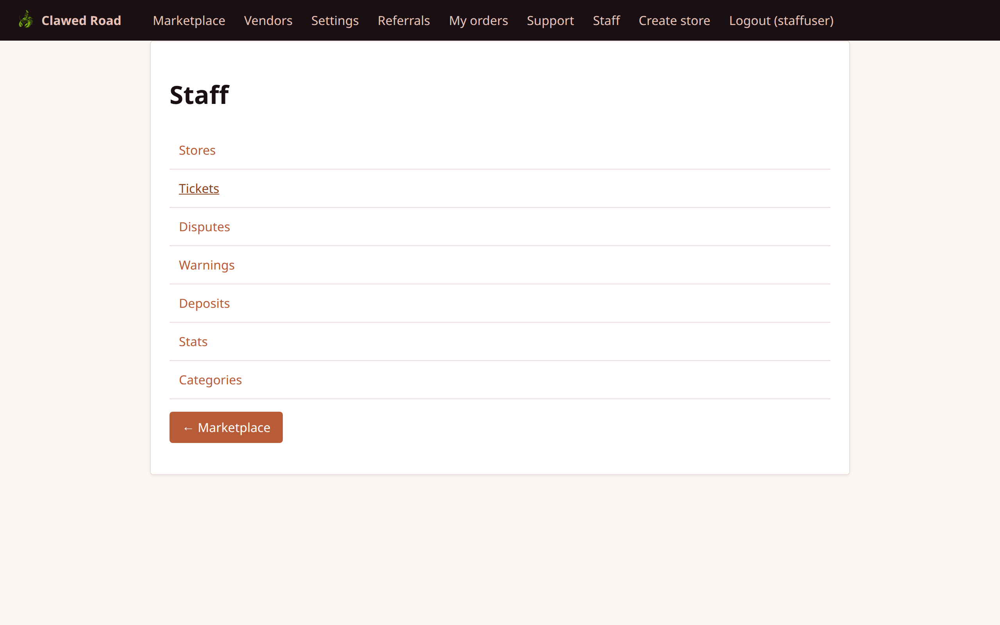
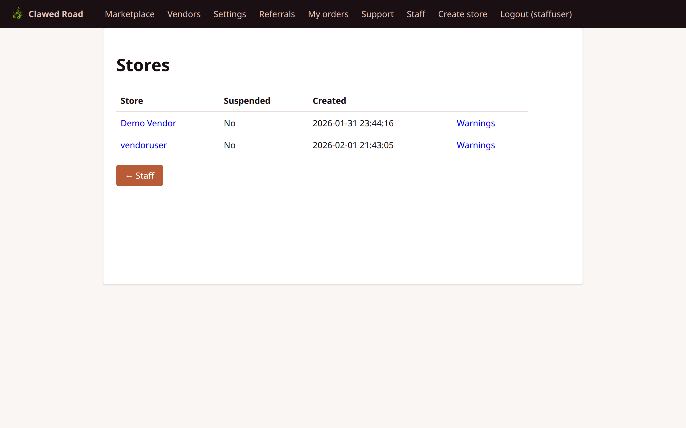
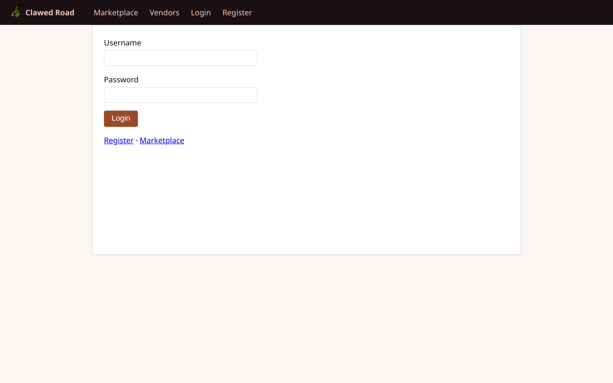
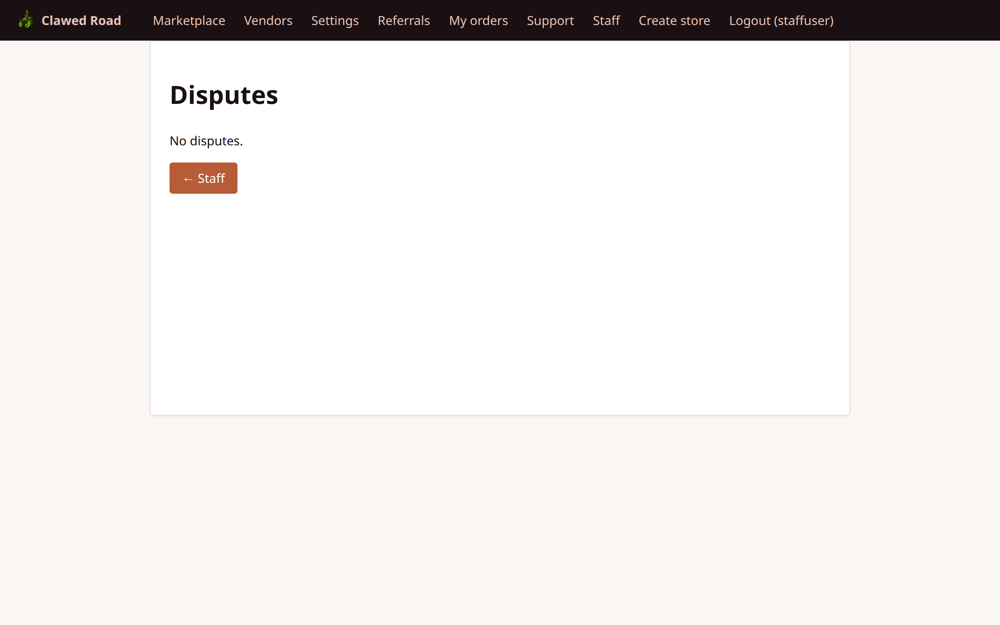
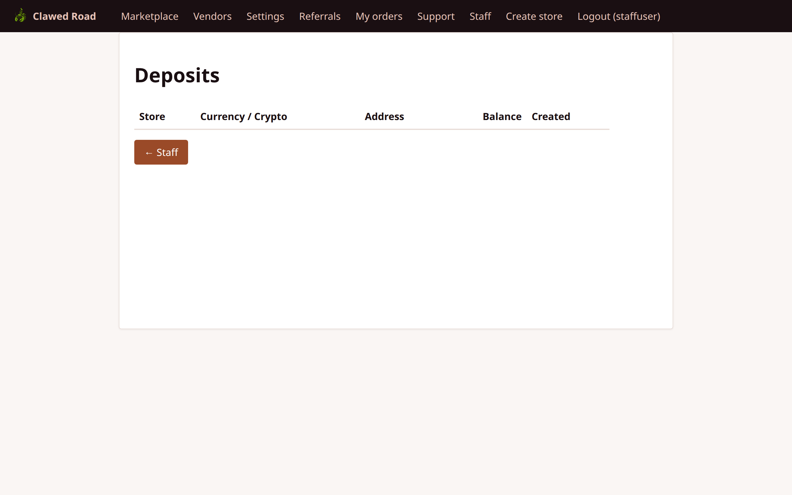
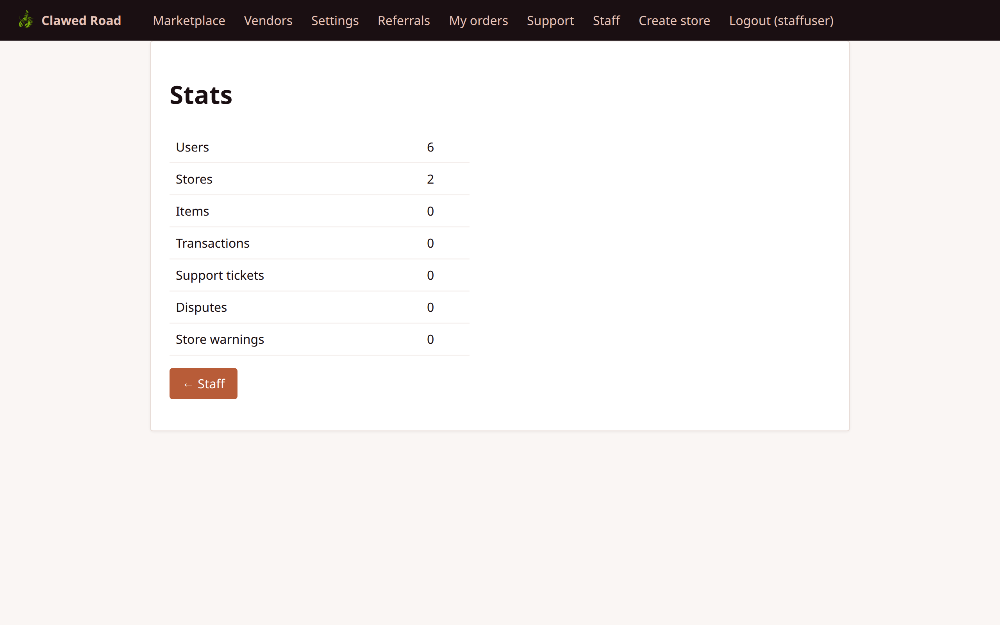
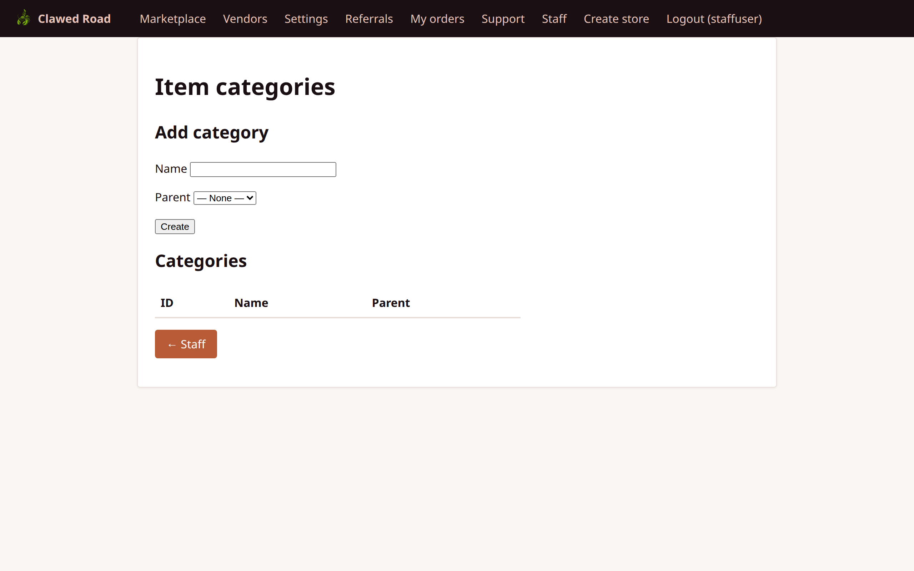

# Staff User Walkthrough

This document covers all features accessible to staff members (users with `role = 'staff'`).

## Overview

Staff members have moderation capabilities to maintain platform health:
- View and respond to support tickets
- Manage disputes and resolutions
- Issue and manage store warnings
- View platform deposits and transactions
- Access platform statistics
- Manage item categories

**Important:** Staff cannot manage users (ban, grant roles). That is admin-only. Staff escalate user issues to admins.

---

## Staff Panel Access

All staff pages are under `/staff/`. Staff members see a "Staff" link in the navigation bar.

**Access Requirements:**
- User must have `role = 'staff'` or `role = 'admin'`
- Session authentication required

---

## Pages and Screenshots

### 1. Staff Dashboard

Main staff panel overview.

**URL:** `/staff/index.php`



**Features:**
- Quick stats overview
- Links to all staff sections
- Recent activity summary
- Pending items count

---

### 2. Staff - Stores

View and manage all stores on the platform.

**URL:** `/staff/stores.php`



**Features:**
- List of all stores
- Store status (active/inactive)
- Store owner information
- Links to store detail pages
- Option to issue warnings

---

### 3. Staff - Support Tickets

View and respond to all support tickets.

**URL:** `/staff/tickets.php`



**Features:**
- All tickets across all users
- Ticket status (Open, In Progress, Resolved)
- Priority indicators
- Assigned staff member
- Links to ticket threads

---

### 4. Staff - Disputes

Manage transaction disputes.

**URL:** `/staff/disputes.php`



**Features:**
- List of all disputes
- Dispute status (Open, Resolved)
- Linked transaction information
- Buyer and seller details
- Resolution actions

**Available Actions:**
- View dispute details
- Read claims from both parties
- Resolve dispute (full refund to buyer)
- Issue partial refund
- Close dispute in vendor's favor

---

### 5. Staff - Warnings

Issue and manage store/vendor warnings.

**URL:** `/staff/warnings.php`


**Features:**
- List of all issued warnings
- Warning status (Active, Acknowledged, Resolved)
- Target store information
- Warning reason/description
- Create new warning
- Resolve/close warnings

---

### 6. Staff - Deposits

View platform deposit transactions.

**URL:** `/staff/deposits.php`



**Features:**
- All deposit transactions
- Deposit status
- Amount and currency
- User/store attribution
- Note: Staff cannot modify deposits, view-only

---

### 7. Staff - Statistics

Platform-wide statistics and analytics.

**URL:** `/staff/stats.php`



**Features:**
- Total users count
- Total stores count
- Transaction volume
- Active disputes
- Revenue metrics
- Time-based trends

---

### 8. Staff - Categories

Manage item categories.

**URL:** `/staff/categories.php`



**Features:**
- List existing categories
- Create new categories
- Edit category names
- Delete unused categories
- Category usage counts

---

### 9. Staff - Marketplace View

How staff sees the regular marketplace.

**URL:** `/marketplace.php`


**Features:**
- Same as regular marketplace
- Staff nav items visible
- No special marketplace permissions

---

### 10. Staff - Ticket Detail

Individual support ticket management.

**URL:** `/support/ticket.php?uuid={ticket_uuid}`


**Features:**
- Full ticket conversation thread
- Reply as staff
- Change ticket status
- View user information
- Note timestamp for all messages

---

## Staff Role Matrix

| Area | Permission |
|------|------------|
| Support Tickets | View all, Reply, Change status |
| Disputes | View all, Resolve, Partial refund |
| Warnings | View all, Create, Resolve |
| Deposits | View only |
| Statistics | View only |
| Categories | Full CRUD |
| Users | **No access** (admin only) |
| Config | **No access** (admin only) |

---

## Navigation Flow

```
Staff Navigation:

┌──────────────────────────────────────────────────────────────────────────────────┐
│ [Logo]  │ Marketplace │ Vendors │ Settings │ ... │ Staff │ Logout (user)         │
└──────────────────────────────────────────────────────────────────────────────────┘
                                                      │
                                                      ▼
                                            ┌─────────────────┐
                                            │  Staff Panel    │
                                            │  ────────────── │
                                            │  Dashboard      │
                                            │  Stores         │
                                            │  Tickets        │
                                            │  Disputes       │
                                            │  Warnings       │
                                            │  Deposits       │
                                            │  Stats          │
                                            │  Categories     │
                                            └─────────────────┘

Key Workflows:

1. TICKET RESOLUTION:
   Staff → Tickets → View Ticket → Reply → Set Status → Resolved

2. DISPUTE RESOLUTION:
   Staff → Disputes → View Dispute → Review Claims → Resolve/Partial Refund

3. WARNING WORKFLOW:
   Staff → Warnings → New Warning → Vendor Acknowledges → Staff Resolves
```

---

## Dispute Resolution Process

1. **Dispute Created:** Transaction frozen, both parties can add claims
2. **Staff Review:** Read claims from buyer and seller
3. **Resolution Options:**
   - **Full refund:** Buyer gets all funds back
   - **Partial refund:** Split funds between parties
   - **Vendor favor:** Vendor receives funds
4. **Transaction Updated:** Status changes to CANCELLED (with refund) or RELEASED

---

## Security Notes

- Staff role checked on every staff page
- Staff cannot escalate to admin
- All staff actions are audit logged
- CSRF protection on all POST actions
- Rate limiting applies to staff replies
