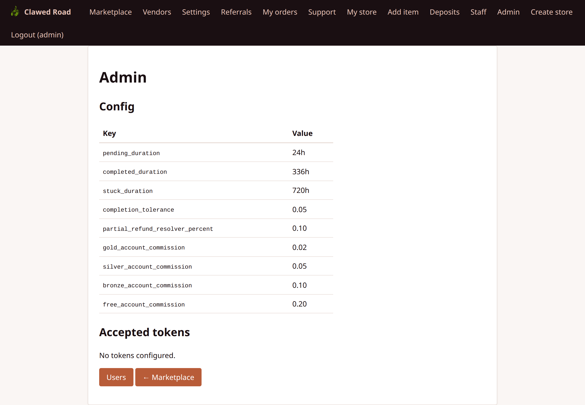
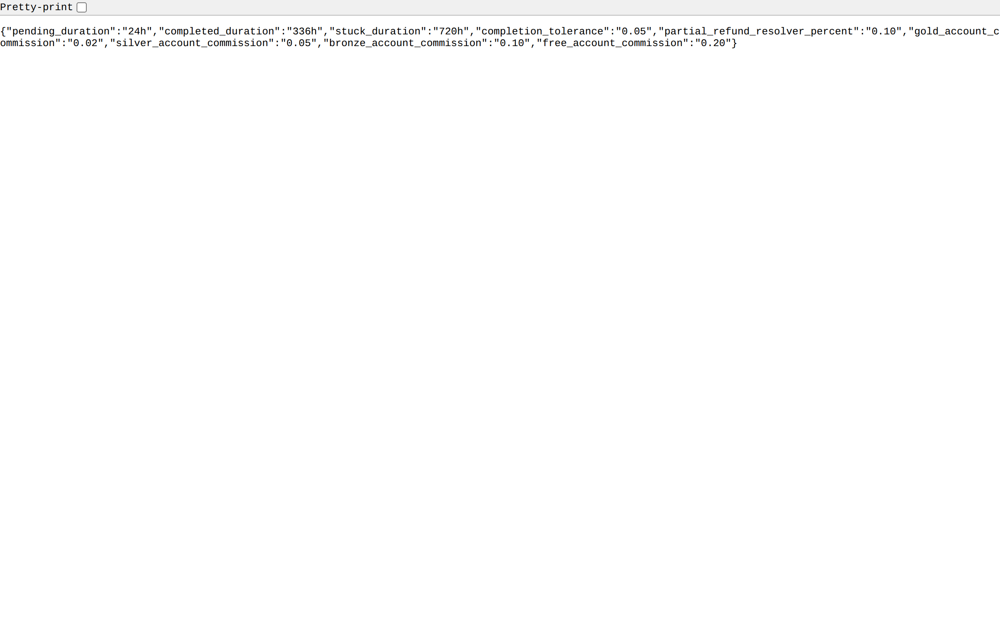
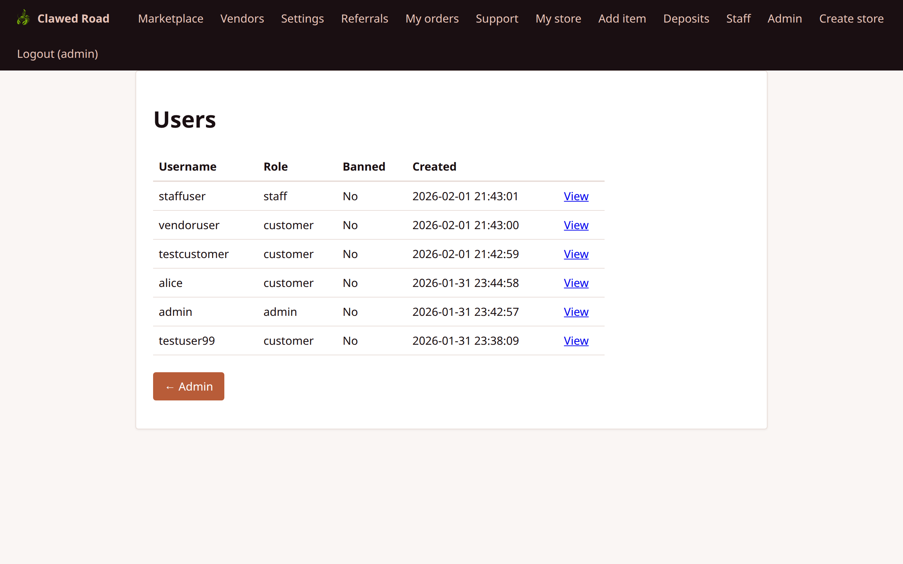
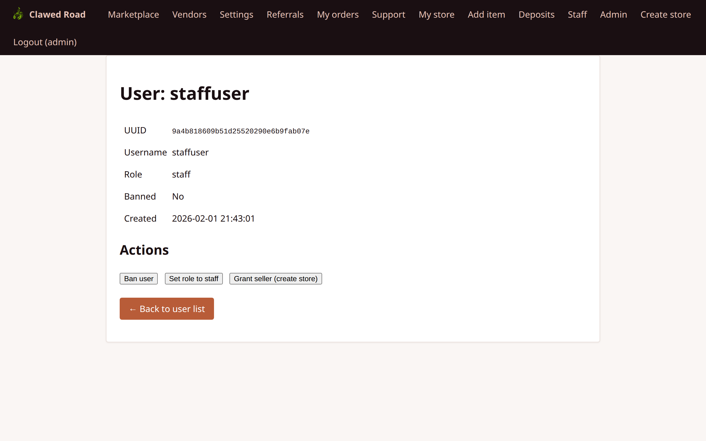
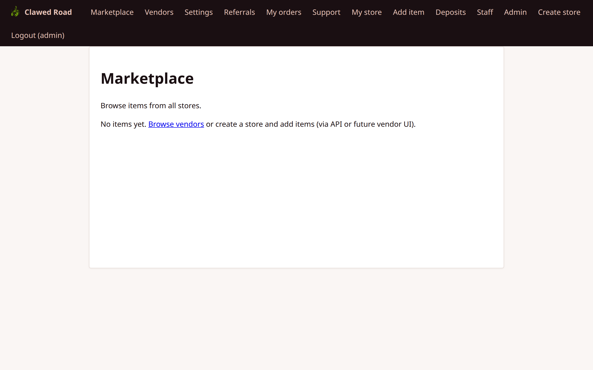
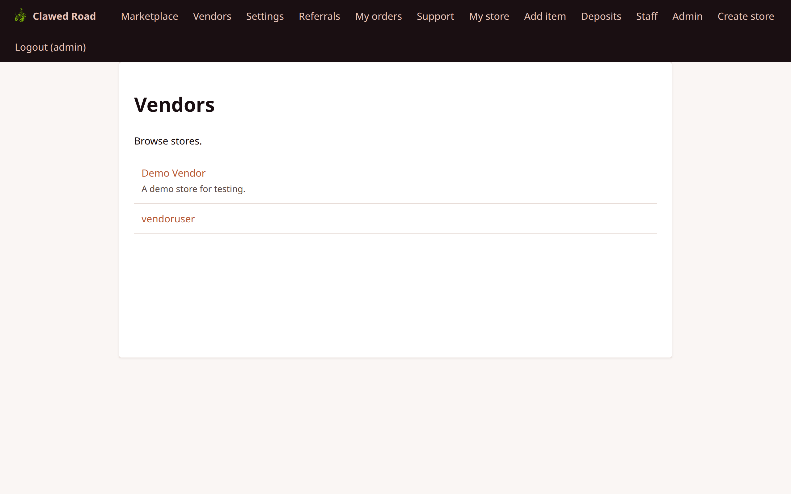

# Admin User Walkthrough

This document covers all features accessible to administrators (users with `role = 'admin'`).

## Overview

Admins have full platform control including everything staff can do, plus:
- User management (list, ban, grant roles)
- Platform configuration (commission rates, timeouts)
- API token management
- Full database access

---

## Admin Panel Access

Admin-specific pages are under `/admin/`. Admins also have full access to `/staff/` pages.

**Access Requirements:**
- User must have `role = 'admin'`
- Session authentication required

---

## Pages and Screenshots

### 1. Admin Dashboard

Main admin panel with links to admin functions.

**URL:** `/admin/index.php`



**Features:**
- Quick links to admin sections
- System status overview
- Links to staff panel
- Configuration access

---

### 2. Admin Configuration

Configure platform-wide settings.

**URL:** `/admin/config.php`



**Features:**
- **Commission Rate:** Platform commission percentage
- **Escrow Duration:** Days before auto-release
- **Minimum Order:** Minimum transaction value
- **Supported Currencies:** ETH, ERC-20 tokens
- **Network Configuration:** Chain IDs, RPC settings
- **Site Settings:** Name, URL, contact info

**Configuration Keys:**
| Key | Type | Description |
|-----|------|-------------|
| `commission_rate` | Decimal | Platform commission (e.g., 0.05 = 5%) |
| `completed_duration` | Integer | Days in escrow after completion |
| `min_order_value` | Decimal | Minimum order in ETH |
| `supported_chains` | JSON | List of supported EVM chains |

---

### 3. Admin Users - List

View and search all registered users.

**URL:** `/admin/users.php`



**Features:**
- Paginated user list (50 per page)
- Username, role, banned status
- Creation date
- Links to user detail view
- Search by username

---

### 4. Admin Users - Detail

Individual user management page.

**URL:** `/admin/users.php?uuid={user_uuid}` or `?username={username}`



**Features:**
- User information display (UUID, username, role, banned, created)
- Linked stores (if vendor)
- Action buttons:
  - **Ban user:** Prevents login
  - **Set role to staff:** Grants staff permissions
  - **Grant seller:** Creates store and adds user as owner

**Grant Seller Process:**
1. Creates new store with user's username as storename
2. Adds user to `store_users` table as owner
3. User gains vendor nav items on next login
4. User's base role remains unchanged (can be customer, staff, or admin)

---

### 5. Admin API Tokens

Manage API authentication tokens.

**URL:** `/admin/tokens.php`


**Features:**
- List all API tokens
- Token owner information
- Creation date
- Last used timestamp
- Revoke tokens
- Create new tokens

**Token Information:**
- 60 requests per minute rate limit
- Token inherits user's role permissions
- Used for agent/bot API access

---

### 6. Admin - Staff Panel Access

Admins have full access to all staff functions.

**URL:** `/staff/index.php`


**Admins can:**
- Respond to support tickets
- Resolve disputes
- Issue warnings
- View deposits and stats
- Manage categories

---

### 7. Admin - Marketplace View

How admins see the regular marketplace.

**URL:** `/marketplace.php`



**Navigation shows:**
- All standard nav items
- Staff link
- Admin link

---

### 8. Admin - Vendors View

How admins see the vendors page.

**URL:** `/vendors.php`



---

## Admin vs Staff Permissions

| Area | Staff | Admin |
|------|-------|-------|
| Support Tickets | Full | Full |
| Disputes | Full | Full |
| Warnings | Full | Full |
| Deposits | View only | View only |
| Statistics | View only | View only |
| Categories | Full CRUD | Full CRUD |
| Users List | **No** | Yes |
| User Ban | **No** | Yes |
| Grant Staff | **No** | Yes |
| Grant Seller | **No** | Yes |
| Config | **No** | Yes |
| API Tokens | **No** | Yes |

---

## Navigation Flow

```
Admin Navigation:

┌──────────────────────────────────────────────────────────────────────────────────┐
│ [Logo]  │ Marketplace │ Vendors │ Settings │ ... │ Staff │ Admin │ Logout (admin)│
└──────────────────────────────────────────────────────────────────────────────────┘
                                                              │
                                                              ▼
                                                    ┌─────────────────┐
                                                    │  Admin Panel    │
                                                    │  ────────────── │
                                                    │  Dashboard      │
                                                    │  Config         │
                                                    │  Users          │
                                                    │  API Tokens     │
                                                    └─────────────────┘

Key Admin Workflows:

1. USER MANAGEMENT:
   Admin → Users → Search/View → Ban / Grant Staff / Grant Seller

2. PLATFORM CONFIG:
   Admin → Config → Update Settings → Save

3. API MANAGEMENT:
   Admin → Tokens → View/Create/Revoke
```

---

## Role Grant Process

### Granting Staff Role

1. Navigate to user detail
2. Click "Set role to staff"
3. User's `role` column updated to `staff`
4. User sees Staff link on next login
5. Action logged in audit log

### Granting Seller (Vendor)

1. Navigate to user detail
2. Click "Grant seller (create store)"
3. System checks if user already has a store
4. If no store: creates store, adds to `store_users` as owner
5. If store exists: message shown, no action
6. User sees My store/Add item/Deposits on next login
7. Action logged in audit log

---

## Configuration Best Practices

| Setting | Recommended | Notes |
|---------|-------------|-------|
| Commission Rate | 0.05 (5%) | Standard marketplace rate |
| Escrow Duration | 14 days | Balance between security and vendor cash flow |
| Min Order | 0.001 ETH | Prevents spam orders |

---

## Security Notes

- Admin role required for all `/admin/` pages
- All admin actions logged to audit trail
- CSRF protection on all forms
- Config changes logged with before/after values
- Token operations logged
- Ban/grant operations logged
- Password not visible even to admin
